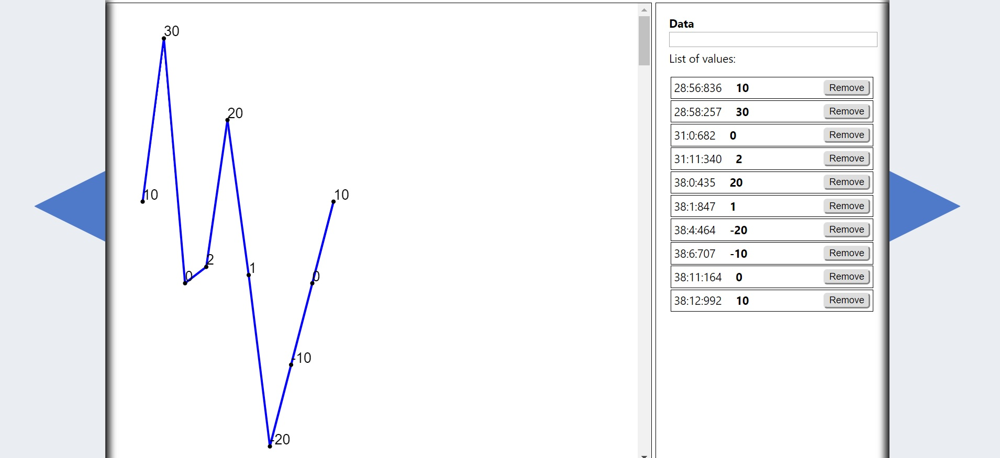
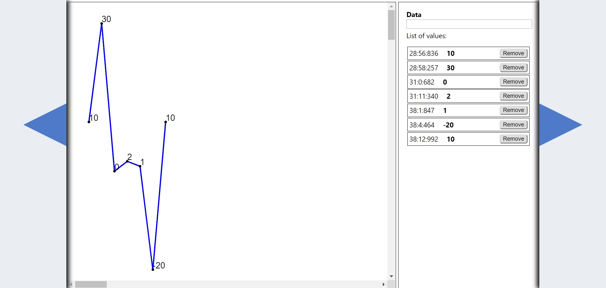
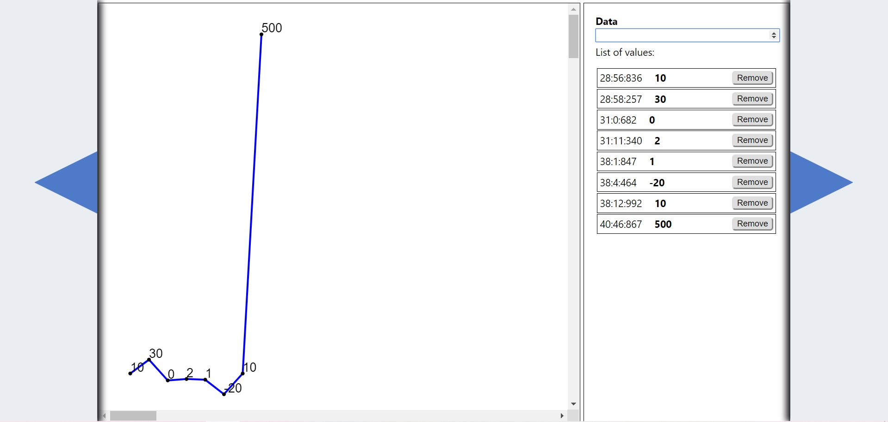
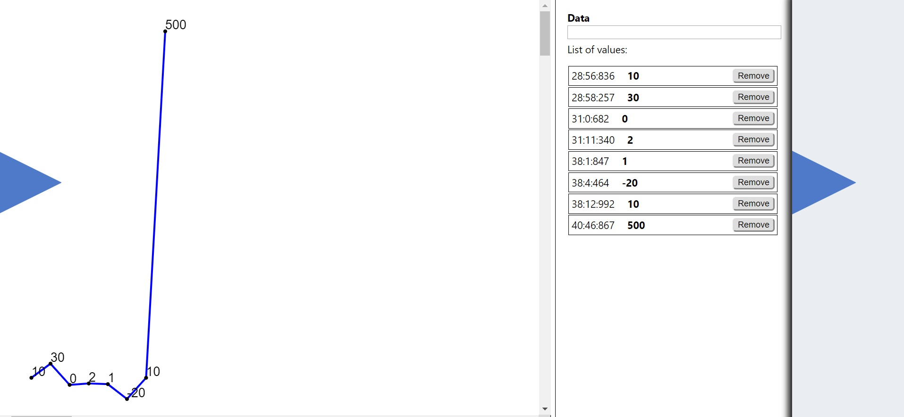

## Siemens Test App

#### Task
Разработать веб-приложение для визуализации временных рядов в виде линейного графика на основе библиотеки d3.js

#### Framework and libraries  
 
- React
- d3.js
- js-hash-code

#### Short Description
Программа представляет собой два компонента `MainComponent` - главный компонент, отвечающий за отрисовку графика,
 обновление данных, `ValuesComponent` - дочерний компонент, который отвечает за валидный ввод значений, формирование 
 списка добавленных точек и их удаление.
#### First steps

##### 1. `npm i `

Установка необходимых библиотек в node_modules

##### 2. `npm start`

Запуск программы

#### Results

